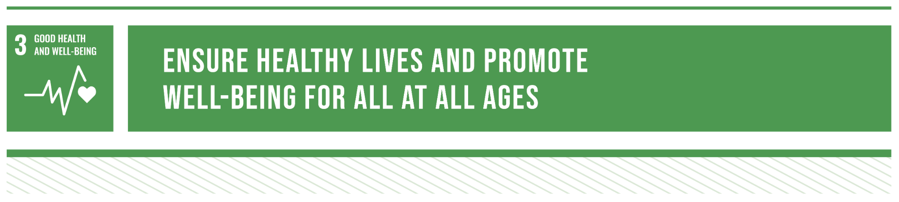

# Grands

Grands is a social media app dedicated to enhancing the well-being of elderly individuals. By fostering social connections, promoting active lifestyles, and providing support, Grands aims to combat loneliness and improve the quality of life for older adults.

## Problem Statement

 
<blockquote align='left'>
<h3>

“Social isolation and loneliness are widespread, with an estimated 1 in 4 older people experiencing social isolation”

\- WHO

</h3>
</blockquote>
 

Many elderly individuals experience social isolation and loneliness, which can have detrimental effects on their mental and physical well-being. Existing social media platforms often fail to adequately address the unique needs of older adults, hindering efforts to foster meaningful connections and support their overall quality of life."

## 🌍  UN's Sustainable Development Goals & Targets

### SDG 3: Good Health and Well-Being (Target: 3.6)

HeadHome directly addresses the issue of **dementia wandering**.

Wandering episodes can bring danger to patients such as traffic incidents, with no way to contact their caregivers. Thus, caregivers might feel the need to micromanage their patients, causing significant caregiver stress.

HeadHome can help these patients by providing clear and simple instructions on the wearable to guide the patient home. It also sends alerts to their caregiver whenever they need help, removing the need for constant tracking and monitoring.

### SDG 11: Sustainable Cities and Communities (Target: 11.a.1)

HeadHome **leverages the power of the community** to improve the lives of dementia patients. Most caregivers have full-time jobs and cannot be with their loved ones 24/7. To ensure that dementia patients can receive help anytime, we will recruit registered volunteers in the community. Caregivers can send out an SOS message to volunteers near the vulnerable patient, who can guide the patients back home. This builds up an inclusive and socially aware community, which can help these patients when they are in need.
