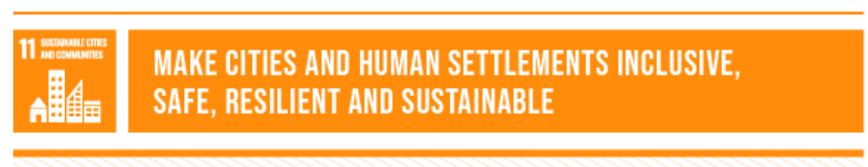

# Grands

Grands is a social media app dedicated to enhancing the well-being of elderly individuals. By fostering social connections, promoting active lifestyles, and providing support, Grands aims to combat loneliness and improve the quality of life for older adults.

## Problem Statement

 
<blockquote align='left'>
<h3>

“Social isolation and loneliness are widespread, with an estimated 1 in 4 older people experiencing social isolation”

\- WHO

</h3>
</blockquote>
 

Many elderly individuals experience social isolation and loneliness, which can have detrimental effects on their mental and physical well-being. Existing social media platforms often fail to adequately address the unique needs of older adults, hindering efforts to foster meaningful connections and support their overall quality of life."

## 🌍  UN's Sustainable Development Goals & Targets

### SDG 3: Good Health and Well-Being (Target: 3.6)

Grands promotes good health and well-being among elderly individuals by fostering **social connections, encouraging physical activity through personalized exercise recommendations, and facilitating access to health-related information**, effectively aligning with the United Nations Sustainable Development Goals on good health and well-being.

### SDG 10: Reduced Inequalities (Target: 11.a.1)

Grands, our social media platform for elderly individuals, addresses the UN Sustainable Development Goal of reducing inequalities by **fostering an inclusive digital community**. Through features like group discussions and shared interest groups, Grands ensures individuals of all backgrounds feel valued and connected.

By encouraging users to share their stories and experiences, Grands promotes a sense of belonging and mutual understanding among elderly individuals. Through this inclusive approach, Grands contributes to social justice and equity, aligning with global efforts to create a more inclusive society.

### SDG 11: Sustainable Cities and Communities (Target: 11.a.1)

Grands, our app designed for elderly individuals, contributes to the Sustainable Cities and Communities goal by creating inclusive digital spaces for communities. Through features like group chats and personalized profiles, Grands connects older adults worldwide, regardless of where they live.

By fostering supportive digital neighborhoods, Grands empowers older adults to share urban living insights and resources. This inclusive approach promotes collaboration and resilience, aligning with global efforts for sustainable and inclusive urban development.
